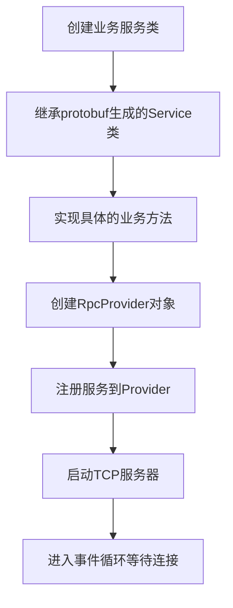
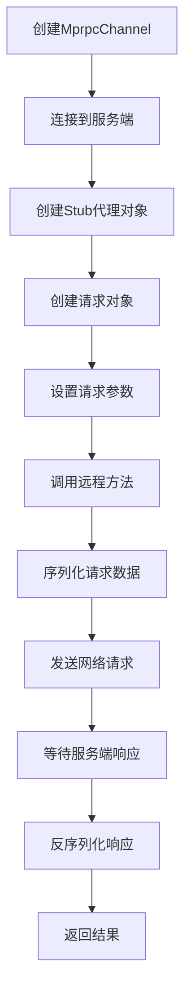

# RPC框架工作流程详解

## 1. 整体架构图

```
┌─────────────────┐    ┌─────────────────┐    ┌─────────────────┐
│   客户端程序     │    │   网络传输层     │    │   服务端程序     │
│                │    │                │    │                │
│ ┌─────────────┐ │    │ ┌─────────────┐ │    │ ┌─────────────┐ │
│ │  业务代码    │ │    │ │   TCP/IP    │ │    │ │  业务代码    │ │
│ │             │ │    │ │   网络       │ │    │ │             │ │
│ └─────────────┘ │    │ └─────────────┘ │    │ └─────────────┘ │
│                │    │                │    │                │
│ ┌─────────────┐ │    │                │    │ ┌─────────────┐ │
│ │   Stub      │ │◄──►│                │◄──►│ │ RpcProvider │ │
│ │  (代理对象)  │ │    │                │    │ │ (服务提供者) │ │
│ └─────────────┘ │    │                │    │ └─────────────┘ │
│                │    │                │    │                │
│ ┌─────────────┐ │    │                │    │ ┌─────────────┐ │
│ │MprpcChannel │ │    │                │    │ │  Muduo      │ │
│ │ (网络通道)   │ │    │                │    │ │ (网络库)    │ │
│ └─────────────┘ │    │                │    │ └─────────────┘ │
└─────────────────┘    └─────────────────┘    └─────────────────┘
```

## 2. 详细工作流程

### 2.1 服务端启动流程



**代码示例：**
```cpp
// 1. 定义服务类
class CalculatorService : public calc::Calculator {
    void Add(...) override { /* 实现加法 */ }
    void Multiply(...) override { /* 实现乘法 */ }
};

// 2. 启动服务
RpcProvider provider;
provider.NotifyService(&calcService);  // 注册服务
provider.Run(0, 8080);                // 启动服务
```

### 2.2 客户端调用流程



**代码示例：**
```cpp
// 1. 创建通道和代理
MprpcChannel channel("127.0.0.1", 8080, true);
calc::Calculator_Stub stub(&channel);

// 2. 发起调用
calc::AddRequest request;
calc::AddResponse response;
request.set_a(10);
request.set_b(20);

stub.Add(&controller, &request, &response, nullptr);
```

### 2.3 网络消息格式

```
┌─────────────┬─────────────┬─────────────┐
│ header_size │ RpcHeader   │   Args      │
│   (4字节)   │ (序列化)    │ (序列化)    │
└─────────────┴─────────────┴─────────────┘
```

**RpcHeader内容：**
- service_name: 服务名 (如 "Calculator")
- method_name: 方法名 (如 "Add")  
- args_size: 参数大小

## 3. 实际项目中的应用

### 3.1 在Raft项目中的使用

```cpp
// 服务端：注册Raft服务
RpcProvider provider;
provider.NotifyService(this);           // 注册KV服务
provider.NotifyService(m_raftNode.get()); // 注册Raft服务
provider.Run(m_me, port);

// 客户端：调用其他节点的Raft方法
RaftRpcUtil rpc("192.168.1.100", 8080);
raftRpcProctoc::RequestVoteArgs args;
raftRpcProctoc::RequestVoteReply reply;
rpc.RequestVote(&args, &reply);
```

### 3.2 消息传递过程

```
客户端请求: RequestVote(term=5, candidateId=1, ...)
    ↓
序列化: [header_size][RpcHeader][RequestVoteArgs]
    ↓
网络发送: TCP数据包
    ↓
服务端接收: 解析header和参数
    ↓
调用本地方法: raft->RequestVote(...)
    ↓
序列化响应: RequestVoteReply
    ↓
网络发送: TCP响应包
    ↓
客户端接收: 解析响应结果
```

## 4. 关键组件详解

### 4.1 MprpcChannel (客户端通道)
- **作用**: 负责网络通信
- **功能**: 
  - 建立TCP连接
  - 序列化请求数据
  - 发送网络请求
  - 接收响应数据
  - 反序列化响应

### 4.2 RpcProvider (服务端提供者)
- **作用**: 管理RPC服务
- **功能**:
  - 注册服务和方法
  - 启动TCP服务器
  - 处理客户端连接
  - 解析RPC请求
  - 调用业务方法
  - 发送响应

### 4.3 MprpcController (控制器)
- **作用**: 管理RPC调用状态
- **功能**:
  - 记录调用是否成功
  - 保存错误信息
  - 提供状态查询接口

## 5. 学习建议

### 5.1 理解顺序
1. **先理解概念**: RPC是什么，为什么需要RPC
2. **看简单示例**: 理解基本的调用流程
3. **深入源码**: 理解各个组件的实现
4. **实际应用**: 看项目中如何使用

### 5.2 重点关注
- **网络通信**: 如何通过网络传输数据
- **序列化**: 如何将对象转换为字节流
- **服务发现**: 如何找到要调用的服务
- **错误处理**: 如何处理网络异常

### 5.3 动手实践
1. 运行示例代码
2. 修改参数观察结果
3. 添加新的服务方法
4. 调试网络通信过程

## 6. 常见问题

**Q: 为什么需要RPC？**
A: 在分布式系统中，不同机器上的程序需要相互调用，RPC让远程调用看起来像本地调用一样简单。

**Q: 序列化是什么？**
A: 将程序中的对象转换为可以在网络上传输的字节流的过程。

**Q: Stub是什么？**
A: 代理对象，客户端通过它来调用远程服务，就像调用本地方法一样。

**Q: 如何保证网络通信的可靠性？**
A: 通过TCP协议、重连机制、错误处理等方式保证通信的可靠性。 